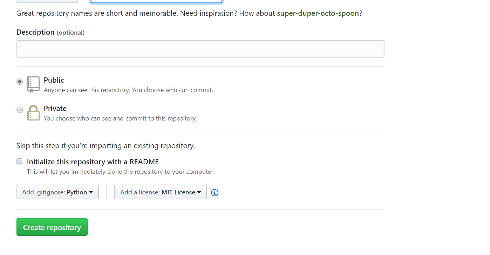

 
#  collaborative working with Git

### **Git Vs GitHub:**
**Git:**

- Git is the command line version control system (VCS) software which works on your local computer.
- You need Git to use GitHub. You can use Git locally without GitHub.

**Installation of Git :**

- If you have already installed Git on your computer. Well and good, you can proceed to the next section.
- If not, You can download it from:[Here ]( https://git-scm.com/downloads).
- If you want some help on installation, find it: [Here ](https://git-scm.com/book/en/v2/Getting-Started-Installing-Git)

**GitHub:**

- GitHub is an internet hosting service for git repositories. Public repos are free; private repos are paid.
- You can keep your project files in organized way that you haven’t imagined before and you can also work in a project with multiple people working on the same at a time. 

**Set-up GitHub:**

- [Click Here](https://github.com/join) to sign up on GitHub with your Email If you have one allready, you can use it. Log in to your account.

###  **Repository:**
- A repository is like a folder for your project. Your project's repository contains all of your project's files and stores each file's revision history. You can also discuss and manage your project's work within the repository.

**Follow steps for creating New Repository**.

1. Go to the homepage of GitHub to see the following screen.
2. At the right top, you have this + icon, clicking on it will open up drop-down window.    
3. You have to click on “New repository” to create a new Repository. 
4. Fill  basic details like the Repository name like give it a nice name. Remember, it’s your first project! Name it the way you like. When you are creating an repository for Your team where you want to keep your project public or private, Here we set up the Public. 
5. Select checkbox **Initialize this repository with a README**  and select **Add.gitignore: Python** and **Add a license: MIT License**
6. Click on “Create repository” successfully create your new repo.

### **Forking Repository:**

- Make a copy of someone else’s GitHub repo in your own GitHub account.

**Follow steps for Forking Repo:**

1. Make sure you’re logged into GitHub with your account.
2. Find the GitHub repository with which you’d like to work.  
3. Click the Fork button on the upper right-hand side of the repository’s page. after you can select your repo from list now I am selecting Rinku92(GitHub account). 


That’s it—you now have a copy of the original repository in your GitHub account


### **Cloning Repository:**
- When you create a repository on GitHub, it exists as a remote repository. You can clone your repository to create a local copy on your computer and sync between the two locations.

**Follow steps for Cloning Repo:**

1. On GitHub, navigate to the main page of the repository.
2. Under the repository name, click **Clone or download.**  
3. To clone the repository using HTTPS, under "Clone with HTTPS", click on Clone or download. To clone the repository copy the URL. 
4. Open CMD.
5. Change the current working directory to the location where you want the cloned directory to be made.
6. Type git clone, and then paste the URL you copied in Step 3. 
7. Press Enter Your local clone will be created. 

###  **PULL Request:**
- Pull requests let you tell others about changes you've pushed to a GitHub repository. Once a pull request is sent, interested parties can review the set of changes, discuss potential modifications, and even push follow-up commits if necessary.

**Follow steps for PULL Request:**

1. Click on PULL Request.
2. Click on new PULL Request( if not selected then click on compare across forks). 
3. Click on “create pull request” along with comments. 
4. In this step the approver will  approve pull request and merge.
5. Click on “Merge pull request” and then “conform merge” successfully merge with REPO. 

### **Branches:**

- Use a branch to isolate development work without affecting other branches in the repository. Each repository has one default branch, and can have multiple other branches. You can merge a branch into another branch using a pull request.

 You can use branches to:
 
    -    Develop features
    -    Fix bugs 
    -    Safely experiment with new ideas

### **Creating Branch:**

1. On GitHub, navigate to the main page of the repository.
2. Click the branch selector menu. 
3. Type a unique name for your new branch, then select Create branch.

### **Deleting Branch:**

1. On GitHub, navigate to the main page of the repository.
2. Above the list of files, click On NUMBER branches.
3. Scroll to the branch that you want to delete, then click

### **Merge Conflict:**

- Merge conflicts happen when people make different changes to the same line in same file, or when one person edits a file and another person deletes the same file.For more information: [Click Here](https://help.github.com/en/articles/about-merge-conflicts)

When conflict happen we can observe like below.


### **Resolving Merge Conflict:**

- To resolve a merge conflict, you must manually edit the conflicted file to select the changes that you want to keep in the final merge.
- If your merge conflict is caused by competing line changes, such as when people make different changes to the same line of the same file on different branches in your Git repository, you can resolve it on GitHub using the conflict editor. For more information, see [Resolve merge conflict using github](https://help.github.com/en/articles/resolving-a-merge-conflict-on-github)
- After conflict : Approver can see below screen.
- After merge by approver : we can  see below screen **Conflict has Resolved**.


### **Avoid merge Conflict:**

Below steps to avoid merge conflicts all together.For More Information [Click Here ](https://dev.to/samuyi/how-to-avoid-merge-conflicts-3j8d)

- Use A diff tool. Its always a good idea to compare branches with a diff tool this can help spot potential trouble spots before merging.
- Use git fetch.
- Use git rerere.

































































































